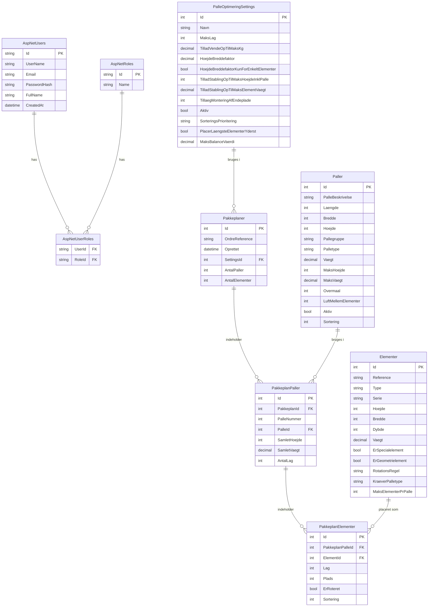

# Database Diagram - PalleOptimering System

Dette diagram viser databasestrukturen for palleoptimering systemet.

## Tabelbeskrivelser

### AspNetUsers (Identity Framework)
Brugere i systemet med ASP.NET Identity integration.
- Roller: SuperUser (admin) eller NormalUser

### Paller
Definerer de forskellige palletyper der kan bruges til pakning.
- Indeholder dimensioner (længde, bredde, højde)
- Maks begrænsninger (vægt, højde)
- Regler (overmål, luft mellem elementer)

### Elementer
Døre og vinduer der skal pakkes på paller.
- Indeholder dimensioner og vægt
- Rotationsregler integreret direkte (ikke separat tabel)
- Special flags (geometrielement, specialelement)

### PalleOptimeringSettings
Globale indstillinger for optimeringsalgoritmen.
- Maks lag, vægtgrænser, sorteringskriterier
- Bruges ved generering af pakkeplaner

### Pakkeplaner
Genererede pakkeplaner for specifikke ordrer.
- Linker til settings der blev brugt
- Indeholder summary (antal paller, elementer)

### PakkeplanPaller
Repræsenterer én palle i en pakkeplan.
- Linker til palle-typen
- Indeholder beregnet vægt og højde

### PakkeplanElementer
Specifikke element-placeringer på paller.
- Lag og plads position
- Om elementet blev roteret
- Sorteringsorden

## Forskelle fra oprindeligt diagram

1. **Integrerede regler**: Rotations-, mellemrums- og stablingsregler er integreret i Paller og Elementer tabellerne i stedet for separate tabeller
2. **Kompleks pakkeplan**: I stedet for én simpel Placering-tabel, er der nu 3 relaterede tabeller (Pakkeplaner → PakkeplanPaller → PakkeplanElementer)
3. **Identity framework**: ASP.NET Identity bruges til brugerstyring (AspNetUsers, AspNetRoles, etc.)
4. **Settings tabel**: PalleOptimeringSettings styrer algoritme-parametre
