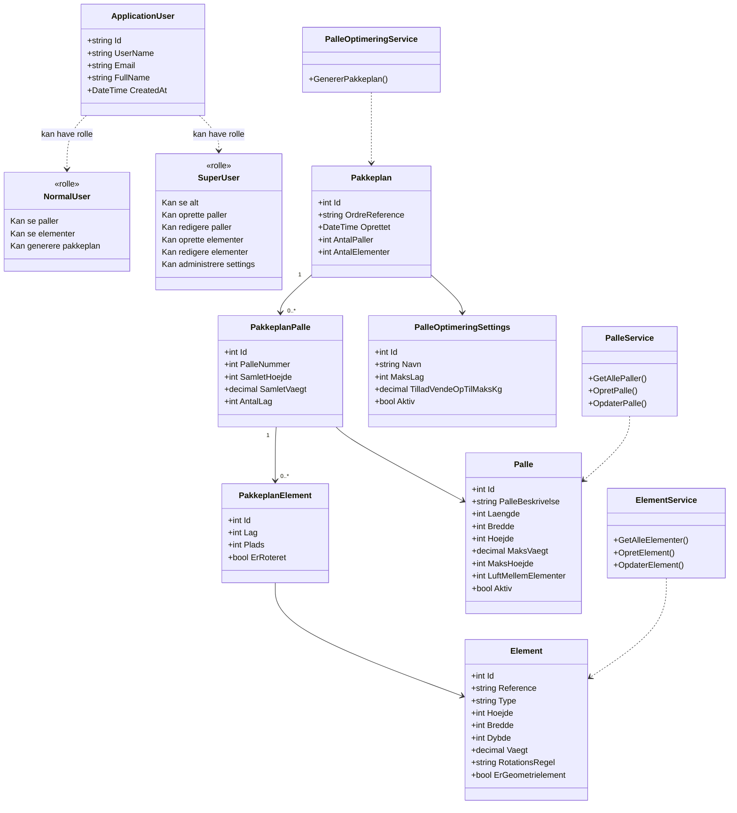

# Klassediagram - PalleOptimering System

Dette diagram viser systemets faktiske struktur.



## Bruger og Roller

### ApplicationUser
- **Én klasse for alle brugere** (extends IdentityUser)
- Roller gemt i AspNetUserRoles tabel
- INGEN nedarvning!

### NormalUser (rolle)
- ✅ Se paller
- ✅ Se elementer
- ✅ Generere pakkeplan
- ❌ Oprette/redigere NOGET

### SuperUser (rolle)
- ✅ Alt NormalUser kan
- ✅ Oprette paller/elementer
- ✅ Redigere paller/elementer (inkl. regler)
- ✅ Slette paller/elementer
- ✅ Administrere settings

## Modeller

### Palle
- Dimensioner: `Laengde`, `Bredde`, `Hoejde`
- Begrænsninger: `MaksVaegt`, `MaksHoejde`
- **Regel integreret**: `LuftMellemElementer` (mellemrumsregel)

### Element
- Dimensioner: `Hoejde`, `Bredde`, `Dybde`, `Vaegt`
- **Regler integreret**:
  - `RotationsRegel` ("Nej", "Ja", "Skal")
  - `ErGeometrielement` (stablingsregel)

### PalleOptimeringSettings
- Globale optimeringsregler
- `MaksLag`, `TilladVendeOpTilMaksKg`, osv.

### Pakkeplan Struktur
```
Pakkeplan (ordre)
  └─ PakkeplanPalle (palle 1, 2, 3...)
      └─ PakkeplanElement (element placering med lag, plads, rotation)
```

## Services

- **PalleService**: CRUD for paller
- **ElementService**: CRUD for elementer
- **PalleOptimeringService**: Genererer pakkeplaner

## Autorisation

| Handling | NormalUser | SuperUser |
|----------|------------|-----------|
| Se paller/elementer | ✅ | ✅ |
| Oprette | ❌ | ✅ |
| Redigere (inkl. regler) | ❌ | ✅ |
| Slette | ❌ | ✅ |
| Generer pakkeplan | ✅ | ✅ |
| Administrer settings | ❌ | ✅ |

## Vigtige Noter

### Regler er integreret (IKKE separate tabeller):
- **Rotationsregel**: `Element.RotationsRegel` property
- **Mellemrumsregel**: `Palle.LuftMellemElementer` property
- **Stablingsregel**: `Element.ErGeometrielement` property

### Roller er IKKE separate klasser:
- De vises kun for klarhed i diagrammet
- I koden: `[Authorize(Roles = "SuperUser")]` attributes

### Teknologi:
- ASP.NET Core 6.0 + Identity
- Entity Framework Core 6
- SQL Server Database
