# Klassediagram - PalleOptimering System

Dette diagram viser de vigtigste klasser og deres relationer i palleoptimering systemet.

```mermaid
classDiagram
    class ApplicationUser {
        +string Id
        +string UserName
        +string Email
        +string FullName
        +DateTime CreatedAt
    }

    class Palle {
        +int Id
        +string PalleBeskrivelse
        +int Laengde
        +int Bredde
        +int Hoejde
        +string Pallegruppe
        +string Palletype
        +decimal Vaegt
        +int MaksHoejde
        +decimal MaksVaegt
        +int Overmaal
        +int LuftMellemElementer
        +bool Aktiv
        +int Sortering
    }

    class Element {
        +int Id
        +string Reference
        +string Type
        +string Serie
        +int Hoejde
        +int Bredde
        +int Dybde
        +decimal Vaegt
        +bool ErSpecialelement
        +bool ErGeometrielement
        +string RotationsRegel
        +string KraeverPalletype
        +int? MaksElementerPrPalle
    }

    class PalleOptimeringSettings {
        +int Id
        +string Navn
        +int MaksLag
        +decimal TilladVendeOpTilMaksKg
        +decimal HoejdeBreddefaktor
        +bool HoejdeBreddefaktorKunForEnkeltElementer
        +int? TilladStablingOpTilMaksHoejdeInklPalle
        +decimal? TilladStablingOpTilMaksElementVaegt
        +int TillaegMonteringAfEndeplade
        +bool Aktiv
        +string SorteringsPrioritering
        +bool PlacerLaengsteElementerYderst
        +decimal? MaksBalanceVaerdi
    }

    class Pakkeplan {
        +int Id
        +string OrdreReference
        +DateTime Oprettet
        +int? SettingsId
        +int AntalPaller
        +int AntalElementer
        +ICollection~PakkeplanPalle~ Paller
    }

    class PakkeplanPalle {
        +int Id
        +int PakkeplanId
        +int PalleNummer
        +int PalleId
        +int SamletHoejde
        +decimal SamletVaegt
        +int AntalLag
        +ICollection~PakkeplanElement~ Elementer
    }

    class PakkeplanElement {
        +int Id
        +int PakkeplanPalleId
        +int ElementId
        +int Lag
        +int Plads
        +bool ErRoteret
        +int Sortering
    }

    class PakkeplanRequest {
        +string OrdreReference
        +List~int~ ElementIds
        +int? SettingsId
    }

    class PakkeplanResultat {
        +string Status
        +List~string~ Meddelelser
        +Pakkeplan Pakkeplan
    }

    class IPalleService {
        <<interface>>
        +GetAllePaller() Task~IEnumerable~Palle~~
        +GetAlleAktivePaller() Task~IEnumerable~Palle~~
        +GetPalle(int id) Task~Palle~
        +OpretPalle(Palle palle) Task~Palle~
        +OpdaterPalle(Palle palle) Task~Palle~
        +SletPalle(int id) Task~bool~
    }

    class IElementService {
        <<interface>>
        +GetAlleElementer() Task~IEnumerable~Element~~
        +GetElement(int id) Task~Element~
        +OpretElement(Element element) Task~Element~
        +OpdaterElement(Element element) Task~Element~
        +SletElement(int id) Task~bool~
        +OpretFlereElementer(IEnumerable~Element~ elementer) Task~IEnumerable~Element~~
    }

    class IPalleOptimeringService {
        <<interface>>
        +GenererPakkeplan(PakkeplanRequest request) Task~PakkeplanResultat~
        +GetPakkeplan(int id) Task~Pakkeplan~
        +GetAllePakkeplaner() Task~IEnumerable~Pakkeplan~~
    }

    class IPalleOptimeringSettingsService {
        <<interface>>
        +GetAlleSettings() Task~IEnumerable~PalleOptimeringSettings~~
        +GetAktivSettings() Task~PalleOptimeringSettings~
        +GetSettings(int id) Task~PalleOptimeringSettings~
        +OpretSettings(PalleOptimeringSettings settings) Task~PalleOptimeringSettings~
        +OpdaterSettings(PalleOptimeringSettings settings) Task~PalleOptimeringSettings~
    }

    class PalleService {
        -PalleOptimeringContext _context
        +GetAllePaller() Task~IEnumerable~Palle~~
        +GetAlleAktivePaller() Task~IEnumerable~Palle~~
        +GetPalle(int id) Task~Palle~
        +OpretPalle(Palle palle) Task~Palle~
        +OpdaterPalle(Palle palle) Task~Palle~
        +SletPalle(int id) Task~bool~
    }

    class ElementService {
        -PalleOptimeringContext _context
        +GetAlleElementer() Task~IEnumerable~Element~~
        +GetElement(int id) Task~Element~
        +OpretElement(Element element) Task~Element~
        +OpdaterElement(Element element) Task~Element~
        +SletElement(int id) Task~bool~
        +OpretFlereElementer(IEnumerable~Element~ elementer) Task~IEnumerable~Element~~
    }

    class PalleOptimeringService {
        -PalleOptimeringContext _context
        -IPalleOptimeringSettingsService _settingsService
        -IPalleService _palleService
        +GenererPakkeplan(PakkeplanRequest request) Task~PakkeplanResultat~
        +GetPakkeplan(int id) Task~Pakkeplan~
        +GetAllePakkeplaner() Task~IEnumerable~Pakkeplan~~
    }

    class PalleOptimeringSettingsService {
        -PalleOptimeringContext _context
        +GetAlleSettings() Task~IEnumerable~PalleOptimeringSettings~~
        +GetAktivSettings() Task~PalleOptimeringSettings~
        +GetSettings(int id) Task~PalleOptimeringSettings~
        +OpretSettings(PalleOptimeringSettings settings) Task~PalleOptimeringSettings~
        +OpdaterSettings(PalleOptimeringSettings settings) Task~PalleOptimeringSettings~
    }

    class PalleOptimeringContext {
        +DbSet~Palle~ Paller
        +DbSet~Element~ Elementer
        +DbSet~PalleOptimeringSettings~ Settings
        +DbSet~Pakkeplan~ Pakkeplaner
        +DbSet~PakkeplanPalle~ PakkeplanPaller
        +DbSet~PakkeplanElement~ PakkeplanElementer
    }

    %% Model relationships
    Pakkeplan "1" --> "0..*" PakkeplanPalle : indeholder
    PakkeplanPalle "1" --> "0..*" PakkeplanElement : indeholder
    PakkeplanPalle --> Palle : bruger
    PakkeplanElement --> Element : placerer
    Pakkeplan --> PalleOptimeringSettings : bruger

    %% Service implementations
    PalleService ..|> IPalleService : implements
    ElementService ..|> IElementService : implements
    PalleOptimeringService ..|> IPalleOptimeringService : implements
    PalleOptimeringSettingsService ..|> IPalleOptimeringSettingsService : implements

    %% Service dependencies
    PalleService --> PalleOptimeringContext : uses
    ElementService --> PalleOptimeringContext : uses
    PalleOptimeringSettingsService --> PalleOptimeringContext : uses
    PalleOptimeringService --> PalleOptimeringContext : uses
    PalleOptimeringService --> IPalleOptimeringSettingsService : uses
    PalleOptimeringService --> IPalleService : uses

    %% DTOs
    PakkeplanRequest ..> IPalleOptimeringService : input
    PakkeplanResultat ..> IPalleOptimeringService : output
    PakkeplanResultat --> Pakkeplan : contains
```

## Klassebeskrivelser

### Models

#### ApplicationUser
Repræsenterer en bruger i systemet. Arver fra IdentityUser (ASP.NET Identity).
- Roller: SuperUser eller NormalUser

#### Palle
Definerer en palle-type med dimensioner, begrænsninger og regler.
- `LuftMellemElementer`: Integreret mellemrumsregel
- `Overmaal`: Hvor meget elementer må rage ud over pallen

#### Element
Repræsenterer døre/vinduer der skal pakkes.
- `RotationsRegel`: Integreret rotationsregel (Nej, Ja, Skal)
- `ErGeometrielement`: Integreret stablingsregel (må ikke stables ovenpå)

#### PalleOptimeringSettings
Globale indstillinger for optimeringsalgoritmen.

#### Pakkeplan / PakkeplanPalle / PakkeplanElement
Hierarchisk struktur der repræsenterer en komplet pakkeplan.

### Services

Alle services følger interface-baseret design for testbarhed og loose coupling.

#### IPalleService / PalleService
CRUD operationer for paller.

#### IElementService / ElementService
CRUD operationer for elementer.

#### IPalleOptimeringSettingsService / PalleOptimeringSettingsService
Håndtering af optimeringsindstillinger.

#### IPalleOptimeringService / PalleOptimeringService
Hovedservice der genererer pakkeplaner.
- Bruger andre services (dependency injection)
- Returnerer PakkeplanResultat med status og meddelelser

### DTOs

#### PakkeplanRequest
Input til pakkeplan-generering.

#### PakkeplanResultat
Output fra pakkeplan-generering med status og eventuelle fejlmeddelelser.

## Vigtige forskelle fra oprindeligt diagram

1. **Ingen Repository Pattern**: Services tilgår DbContext direkte
2. **Interface-baseret**: Alle services har interfaces for dependency injection
3. **Ingen metoder på User**: Logikken er i Controllers og Services, ikke på User-klassen
4. **Integrerede regler**: Regler er properties på modellerne, ikke separate klasser
5. **DTO klasser**: PakkeplanRequest og PakkeplanResultat for API kommunikation
