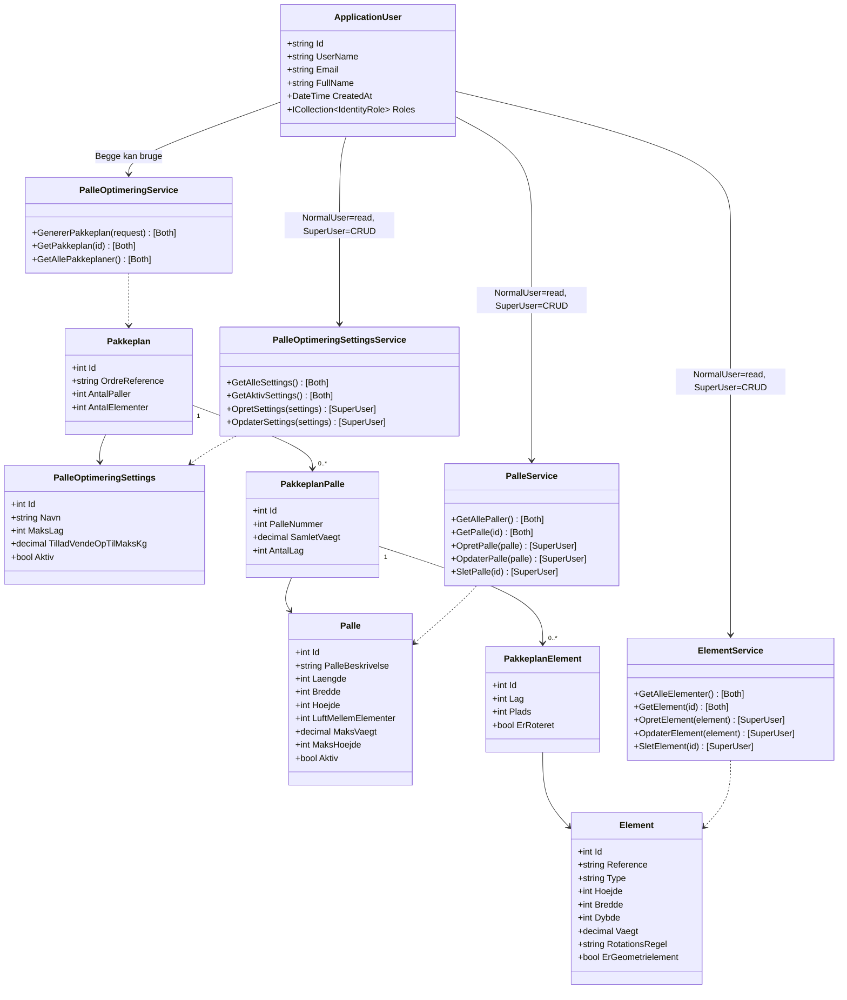

# Klassediagram - PalleOptimering System (1:1 med koden)

Dette diagram viser **præcis** hvad de forskellige brugerroller kan i systemet.



## Bruger Adgang (fra faktisk kode)

### ApplicationUser
**Én klasse for alle brugere** - extends `IdentityUser`

Rolle gemt i `AspNetUserRoles` tabel:
- `"NormalUser"` ELLER `"SuperUser"`

### NormalUser Rolle - Read-Only

**PalleService:**
```csharp
[Authorize(Roles = "SuperUser,NormalUser")]
GetAllePaller()     ✅ Kan kalde
GetPalle(id)        ✅ Kan kalde

[Authorize(Roles = "SuperUser")]
OpretPalle()        ❌ FORBIDDEN 403
OpdaterPalle()      ❌ FORBIDDEN 403
SletPalle()         ❌ FORBIDDEN 403
```

**ElementService:**
```csharp
[Authorize(Roles = "SuperUser,NormalUser")]
GetAlleElementer()  ✅ Kan kalde
GetElement(id)      ✅ Kan kalde

[Authorize(Roles = "SuperUser")]
OpretElement()      ❌ FORBIDDEN 403
OpdaterElement()    ❌ FORBIDDEN 403 (inkl. ændre regler)
SletElement()       ❌ FORBIDDEN 403
```

**PalleOptimeringService:**
```csharp
[Authorize(Roles = "SuperUser,NormalUser")]
GenererPakkeplan()  ✅ Kan kalde
GetPakkeplan()      ✅ Kan kalde
```

**PalleOptimeringSettingsService:**
```csharp
[Authorize(Roles = "SuperUser,NormalUser")]
GetAlleSettings()   ✅ Kan kalde
GetAktivSettings()  ✅ Kan kalde

[Authorize(Roles = "SuperUser")]
OpretSettings()     ❌ FORBIDDEN 403
OpdaterSettings()   ❌ FORBIDDEN 403
```

### SuperUser Rolle - Fuld Adgang

**PalleService:**
```csharp
GetAllePaller()     ✅ Kan kalde
GetPalle(id)        ✅ Kan kalde
OpretPalle()        ✅ Kan kalde
OpdaterPalle()      ✅ Kan kalde (inkl. ændre LuftMellemElementer)
SletPalle()         ✅ Kan kalde
```

**ElementService:**
```csharp
GetAlleElementer()  ✅ Kan kalde
GetElement(id)      ✅ Kan kalde
OpretElement()      ✅ Kan kalde (inkl. sætte regler)
OpdaterElement()    ✅ Kan kalde (inkl. ændre RotationsRegel, ErGeometrielement)
SletElement()       ✅ Kan kalde
```

**PalleOptimeringService:**
```csharp
GenererPakkeplan()  ✅ Kan kalde
GetPakkeplan()      ✅ Kan kalde
GetAllePakkeplaner() ✅ Kan kalde
```

**PalleOptimeringSettingsService:**
```csharp
GetAlleSettings()   ✅ Kan kalde
GetAktivSettings()  ✅ Kan kalde
OpretSettings()     ✅ Kan kalde
OpdaterSettings()   ✅ Kan kalde (ændre globale optimeringsregler)
```

## Adgangskontrol i Praksis

### Fra Controllers (faktisk kode):

**PallerController.cs:**
```csharp
[HttpGet]
[Authorize(Roles = "SuperUser,NormalUser")]  // ← Begge kan se
public async Task<ActionResult> GetAllePaller() { }

[HttpPost]
[Authorize(Roles = "SuperUser")]  // ← Kun SuperUser kan oprette
public async Task<ActionResult> OpretPalle(Palle palle) { }

[HttpPut("{id}")]
[Authorize(Roles = "SuperUser")]  // ← Kun SuperUser kan redigere
public async Task<ActionResult> OpdaterPalle(int id, Palle palle) { }
```

**ElementerController.cs:**
```csharp
[HttpGet]
[Authorize(Roles = "SuperUser,NormalUser")]  // ← Begge kan se
public async Task<ActionResult> GetAlleElementer() { }

[HttpPut("{id}")]
[Authorize(Roles = "SuperUser")]  // ← Kun SuperUser kan redigere regler
public async Task<ActionResult> OpdaterElement(int id, Element element)
{
    // Kan ændre element.RotationsRegel
    // Kan ændre element.ErGeometrielement
}
```

## Opsummering

| Handling | NormalUser | SuperUser | Kode Reference |
|----------|------------|-----------|----------------|
| **Se paller** | ✅ | ✅ | `[Authorize(Roles = "SuperUser,NormalUser")]` |
| **Oprette paller** | ❌ 403 | ✅ | `[Authorize(Roles = "SuperUser")]` |
| **Redigere paller (inkl. LuftMellemElementer)** | ❌ 403 | ✅ | `[Authorize(Roles = "SuperUser")]` |
| **Slette paller** | ❌ 403 | ✅ | `[Authorize(Roles = "SuperUser")]` |
| **Se elementer** | ✅ | ✅ | `[Authorize(Roles = "SuperUser,NormalUser")]` |
| **Oprette elementer (inkl. sætte regler)** | ❌ 403 | ✅ | `[Authorize(Roles = "SuperUser")]` |
| **Redigere elementer (inkl. RotationsRegel, ErGeometrielement)** | ❌ 403 | ✅ | `[Authorize(Roles = "SuperUser")]` |
| **Slette elementer** | ❌ 403 | ✅ | `[Authorize(Roles = "SuperUser")]` |
| **Generer pakkeplan** | ✅ | ✅ | `[Authorize(Roles = "SuperUser,NormalUser")]` |
| **Se settings** | ✅ | ✅ | `[Authorize(Roles = "SuperUser,NormalUser")]` |
| **Administrer settings** | ❌ 403 | ✅ | `[Authorize(Roles = "SuperUser")]` |

## Integrerede Regler

**Regler er properties på modellerne:**
- **Rotationsregel**: `Element.RotationsRegel` ("Nej", "Ja", "Skal")
- **Mellemrumsregel**: `Palle.LuftMellemElementer` (int i mm)
- **Stablingsregel**: `Element.ErGeometrielement` (bool)

**Kun SuperUser kan ændre disse via OpdaterElement() og OpdaterPalle() metoder.**

Dette klassediagram er nu 1:1 med den faktiske kode og viser præcis hvad hver rolle kan!
