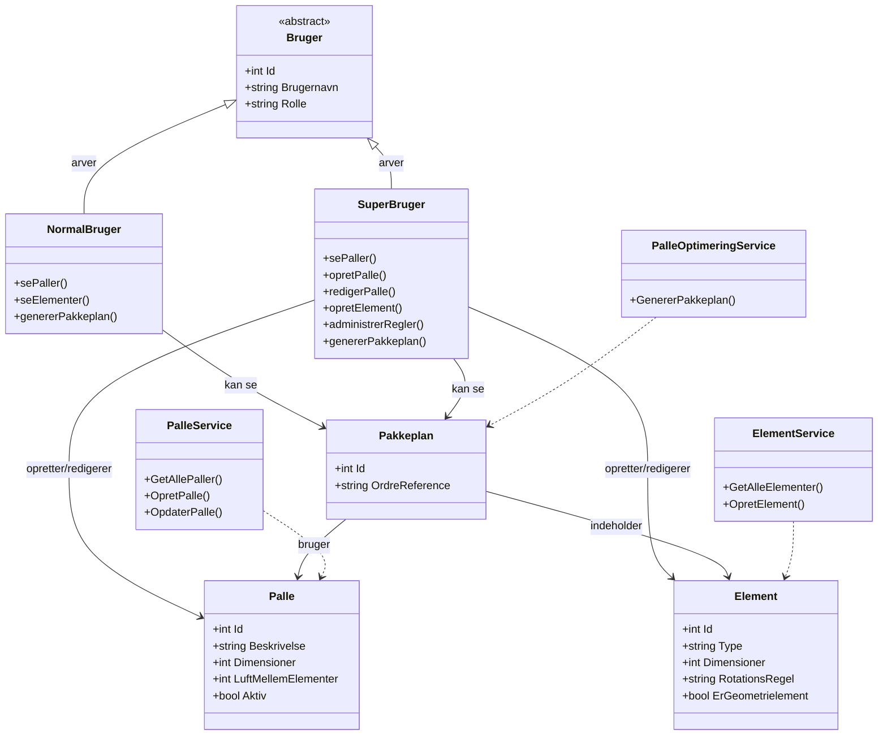

# Klassediagram - PalleOptimering System

Dette diagram viser systemets kernestruktur - simpelt og klart.

## Forklaring

### Bruger Hierarki

- **Bruger (abstract)**: Basis klasse med fælles properties
- **NormalBruger**: Read-only adgang - kan se og generere pakkeplaner
- **SuperBruger**: Fuld adgang - kan oprette, redigere og administrere alt

### Modeller

**Palle**
- Definerer palle-type med dimensioner
- `LuftMellemElementer`: Mellemrumsregel integreret

**Element**
- Døre/vinduer der skal pakkes
- `RotationsRegel`: Rotationsregel integreret (Nej/Ja/Skal)
- `ErGeometrielement`: Stablingsregel integreret

**Pakkeplan**
- Resultat af pakkeplan-generering
- Indeholder elementer placeret på paller

### Services

- **PalleService**: Håndterer paller (CRUD)
- **ElementService**: Håndterer elementer (CRUD)
- **PalleOptimeringService**: Genererer pakkeplaner

## Rettigheder

| Handling | NormalBruger | SuperBruger |
|----------|--------------|-------------|
| Se paller/elementer | ✅ | ✅ |
| Oprette/redigere | ❌ | ✅ |
| Generer pakkeplan | ✅ | ✅ |

## Vigtige Noter

**Integrerede Regler:**
- Rotationsregel: `Element.RotationsRegel`
- Mellemrumsregel: `Palle.LuftMellemElementer`
- Stablingsregel: `Element.ErGeometrielement`

**Implementation:**
- ASP.NET Core med Identity
- Role-based authorization
- Entity Framework Core
