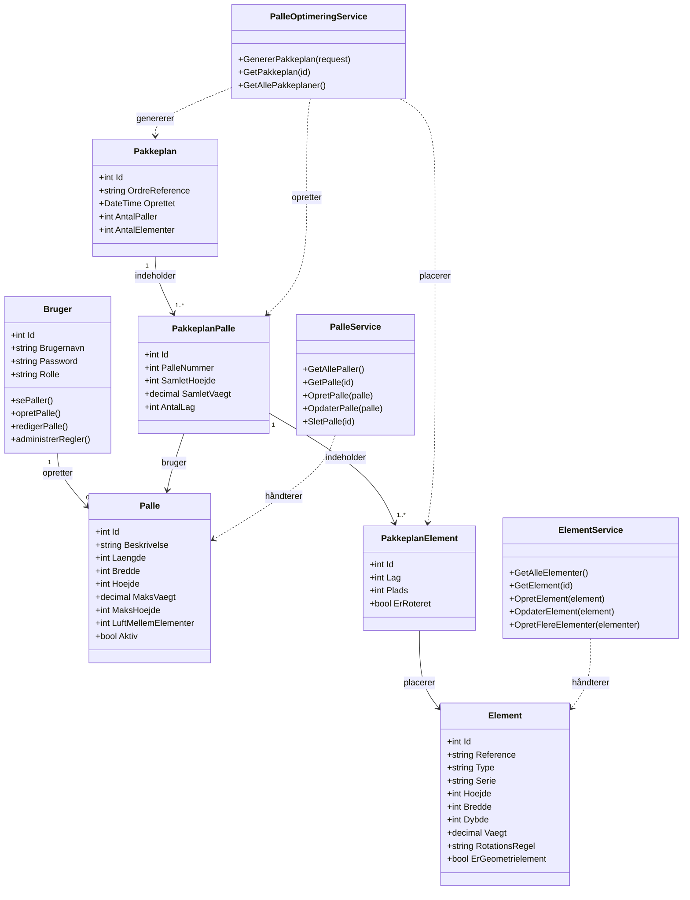

# Klassediagram - PalleOptimering System

Dette diagram viser de vigtigste klasser og deres relationer.

## Forklaring af Klasser

### Domæne Modeller

**Bruger**
- Repræsenterer en bruger (SuperUser eller NormalUser)
- Metoder repræsenterer de handlinger brugeren kan udføre

**Palle**
- Definerer en palle-type med dimensioner og begrænsninger
- `LuftMellemElementer`: Regel for afstand mellem elementer

**Element**
- Døre/vinduer der skal pakkes
- `RotationsRegel`: Om elementet må/skal roteres (Nej, Ja, Skal)
- `ErGeometrielement`: Om der må stables ovenpå (stablingsregel)

**Pakkeplan → PakkeplanPalle → PakkeplanElement**
- Hierarkisk struktur for en komplet pakkeplan
- Én pakkeplan kan have flere paller
- Hver palle kan have flere elementer i forskellige lag

### Services (Forretningslogik)

**PalleService**
- CRUD operationer for paller
- Henter aktive paller til optimering

**ElementService**
- CRUD operationer for elementer
- Kan oprette mange elementer samtidig

**PalleOptimeringService**
- Kerne-service der genererer pakkeplaner
- Anvender rotations-, mellemrums- og stablingsregler
- Finder den bedste palle for hvert element

## Vigtige Noter

### Integrerede Regler
Reglerne er **integreret** i modellerne i stedet for separate klasser:
- **Rotationsregel**: `Element.RotationsRegel` property
- **Mellemrumsregel**: `Palle.LuftMellemElementer` property
- **Stablingsregel**: `Element.ErGeometrielement` property

### Service Pattern
- Services håndterer al forretningslogik
- Modeller er rene data-objekter (minus Bruger der har metoder i diagrammet)
- I koden bruges ASP.NET Identity til brugerstyring
