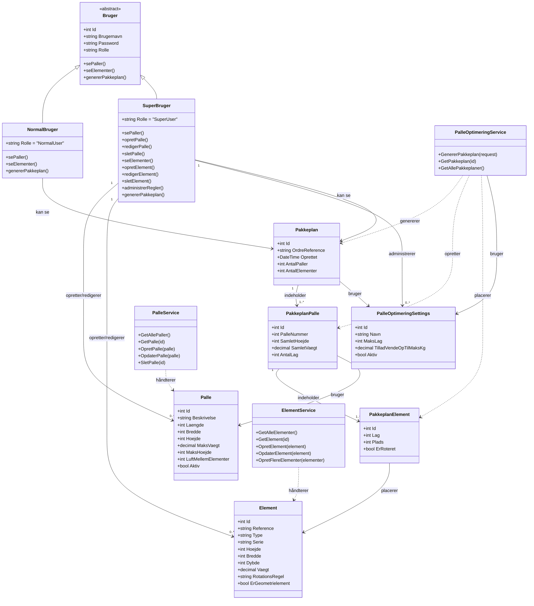

# Klassediagram - PalleOptimering System

Dette diagram viser de vigtigste klasser og deres relationer.

## Forklaring af Klasser

### Bruger Hierarki

**Bruger (Abstract)**
- Basis klasse for alle brugertyper
- Indeholder fælles properties og grundlæggende metoder

**NormalBruger**
- Read-only adgang til systemet
- Kan se paller, elementer og generere pakkeplaner
- Kan IKKE oprette, redigere eller slette

**SuperBruger**
- Fuld adgang til systemet (administrator)
- Kan oprette, redigere og slette paller
- Kan oprette, redigere og slette elementer
- Kan administrere optimeringsregler (PalleOptimeringSettings)
- Kan generere pakkeplaner

### Domæne Modeller

**Palle**
- Definerer en palle-type med dimensioner og begrænsninger
- `LuftMellemElementer`: Regel for afstand mellem elementer (mellemrumsregel)
- SuperBruger kan administrere paller

**Element**
- Døre/vinduer der skal pakkes
- `RotationsRegel`: Om elementet må/skal roteres (Nej, Ja, Skal)
- `ErGeometrielement`: Om der må stables ovenpå (stablingsregel)
- SuperBruger kan administrere elementer

**PalleOptimeringSettings**
- Indstillinger for optimeringsalgoritmen
- `MaksLag`: Maksimalt antal lag på en palle
- `TilladVendeOpTilMaksKg`: Vægtgrænse for rotation
- Kun SuperBruger kan administrere

**Pakkeplan → PakkeplanPalle → PakkeplanElement**
- Hierarkisk struktur for en komplet pakkeplan
- Én pakkeplan kan have flere paller
- Hver palle kan have flere elementer i forskellige lag
- Både NormalBruger og SuperBruger kan se pakkeplaner

### Services (Forretningslogik)

**PalleService**
- CRUD operationer for paller
- Henter aktive paller til optimering
- Bruges af SuperBruger til administration

**ElementService**
- CRUD operationer for elementer
- Kan oprette mange elementer samtidig
- Bruges af SuperBruger til administration

**PalleOptimeringService**
- Kerne-service der genererer pakkeplaner
- Anvender rotations-, mellemrums- og stablingsregler
- Finder den bedste palle for hvert element
- Bruges af både NormalBruger og SuperBruger

## Rettigheder

| Handling | NormalBruger | SuperBruger |
|----------|--------------|-------------|
| Se paller | ✅ | ✅ |
| Opret/rediger/slet paller | ❌ | ✅ |
| Se elementer | ✅ | ✅ |
| Opret/rediger/slet elementer | ❌ | ✅ |
| Generer pakkeplan | ✅ | ✅ |
| Administrer regler | ❌ | ✅ |

## Vigtige Noter

### Integrerede Regler
Reglerne er **integreret** i modellerne i stedet for separate klasser:
- **Rotationsregel**: `Element.RotationsRegel` property
- **Mellemrumsregel**: `Palle.LuftMellemElementer` property
- **Stablingsregel**: `Element.ErGeometrielement` property
- **Optimeringsregler**: `PalleOptimeringSettings` klasse

### Rolle-baseret Adgangskontrol
- I koden implementeres dette via ASP.NET Identity
- `[Authorize(Roles = "SuperUser")]` på admin-endpoints
- `[Authorize(Roles = "SuperUser,NormalUser")]` på read-endpoints
