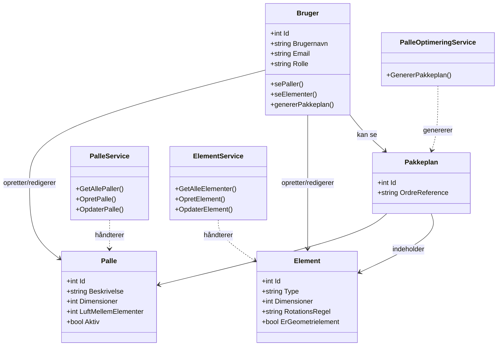

# Klassediagram - PalleOptimering System

Dette diagram viser systemets kernestruktur - simpelt og klart.

## Bruger Roller

**Bruger klasse** (ApplicationUser i koden)
- Rolle property: `"NormalUser"` eller `"SuperUser"`

| Rolle | Rettigheder |
|-------|-------------|
| **NormalUser** | Read-only: Se paller, se elementer, generer pakkeplan |
| **SuperUser** | Fuld adgang: Oprette, redigere, slette alt + administrere regler |

## Modeller

**Palle**
- Definerer palle-type med dimensioner
- `LuftMellemElementer`: Mellemrumsregel (integreret)

**Element**
- Døre/vinduer der skal pakkes
- `RotationsRegel`: Rotationsregel (Nej/Ja/Skal) - integreret
- `ErGeometrielement`: Stablingsregel - integreret

**Pakkeplan**
- Resultat af pakkeplan-generering
- Indeholder elementer placeret på paller

## Services

- **PalleService**: CRUD for paller (kun SuperUser kan oprette/redigere)
- **ElementService**: CRUD for elementer (kun SuperUser kan oprette/redigere)
- **PalleOptimeringService**: Genererer pakkeplaner (begge roller)

## Ændre Regler

**SuperUser kan ændre regler:**
- På Element: `RotationsRegel`, `ErGeometrielement`
- På Palle: `LuftMellemElementer`
- Ændres via redigering af element/palle (én UPDATE operation)

## Integrerede Regler

Regler er **properties** på modellerne:
- **Rotationsregel**: `Element.RotationsRegel` property
- **Mellemrumsregel**: `Palle.LuftMellemElementer` property
- **Stablingsregel**: `Element.ErGeometrielement` property

## Implementation

- ASP.NET Core Identity: `ApplicationUser extends IdentityUser`
- Roller: `AspNetRoles` og `AspNetUserRoles` tabeller
- Authorization: `[Authorize(Roles = "SuperUser")]`
- ORM: Entity Framework Core
