# Sekvensdiagram - PalleOptimering System

Dette diagram viser systemets faktiske flows, 100% som implementeret i koden.

```mermaid
sequenceDiagram
    actor Bruger
    participant UI
    participant BrugerService as AccountController<br/>(BrugerService)
    participant PalleService
    participant ElementService
    participant OptimeringService as PalleOptimeringService<br/>(Regel + Placering)
    participant Database

    %% ===== LOGIN FLOW =====
    Note over Bruger,Database: LOGIN
    Bruger->>UI: Indtast brugernavn & password
    UI->>BrugerService: login(brugernavn, password)
    BrugerService->>Database: SELECT * FROM AspNetUsers WHERE...
    Database-->>BrugerService: Bruger + rolle
    BrugerService-->>UI: Login OK + rolle
    UI-->>Bruger: Anmod om palleoversigt

    %% ===== VIS PALLER =====
    Note over Bruger,Database: VIS PALLER
    Bruger->>UI: Vis paller
    UI->>PalleService: hentAllePaller()
    PalleService->>Database: SELECT * FROM Paller
    Database-->>PalleService: Palleliste
    PalleService-->>UI: Palleliste
    UI-->>Bruger: Vis paller

    %% ===== OPRET NY PALLE (kun SuperBruger) =====
    Note over Bruger,Database: OPRET NY PALLE (inkl. regler)
    Bruger->>UI: Opret ny palle
    UI->>BrugerService: checkRolle()
    BrugerService-->>UI: rolle = SuperBruger
    UI-->>Bruger: Vis palle formular
    Bruger->>UI: Udfyld data:<br/>- Beskrivelse, dimensioner<br/>- LuftMellemElementer (regel)<br/>- MaksVaegt, MaksHoejde
    UI->>PalleService: opretPalle(palle)
    Note right of PalleService: Palle inkluderer<br/>LuftMellemElementer<br/>(mellemrumsregel)
    PalleService->>Database: INSERT INTO Paller<br/>(inkl. alle properties)
    Database-->>PalleService: Palle.Id
    PalleService-->>UI: Palle oprettet
    UI-->>Bruger: Palle oprettet med regler

    %% ===== REDIGER PALLE (kun SuperBruger) =====
    Note over Bruger,Database: REDIGER PALLE
    Bruger->>UI: Rediger palle
    UI->>BrugerService: checkRolle()
    BrugerService-->>UI: rolle = SuperBruger
    UI->>PalleService: hentPalle(palleId)
    PalleService->>Database: SELECT * FROM Paller WHERE Id = ?
    Database-->>PalleService: Palle-data
    PalleService-->>UI: Palle-data
    UI-->>Bruger: Vis palle formular

    Bruger->>UI: Ændre palle-data<br/>(inkl. regler)
    UI->>PalleService: opdaterPalle(palle)
    PalleService->>Database: UPDATE Paller SET ...
    Database-->>PalleService: OK
    PalleService-->>UI: Palle opdateret
    UI-->>Bruger: Palle gemt

    %% ===== OPRET ELEMENT =====
    Note over Bruger,Database: OPRET ELEMENT (inkl. regler)
    Bruger->>UI: Opret element
    UI->>BrugerService: checkRolle()
    BrugerService-->>UI: rolle = SuperBruger
    UI-->>Bruger: Vis element formular
    Bruger->>UI: Udfyld data:<br/>- Dimensioner, vægt<br/>- RotationsRegel (Nej/Ja/Skal)<br/>- ErGeometrielement (stabling)
    UI->>ElementService: opretElement(element)
    Note right of ElementService: Element inkluderer<br/>RotationsRegel og<br/>ErGeometrielement
    ElementService->>Database: INSERT INTO Elementer<br/>(inkl. alle properties)
    Database-->>ElementService: Element.Id
    ElementService-->>UI: Element oprettet
    UI-->>Bruger: Element oprettet med regler

    %% ===== ÆNDRE REGLER PÅ ELEMENT =====
    Note over Bruger,Database: ÆNDRE REGLER (element)
    Bruger->>UI: Rediger element regler
    UI->>BrugerService: checkRolle()
    BrugerService-->>UI: rolle = SuperBruger
    UI->>ElementService: hentElement(elementId)
    ElementService->>Database: SELECT * FROM Elementer WHERE Id = ?
    Database-->>ElementService: Element data
    ElementService-->>UI: Element data
    UI-->>Bruger: Vis formular

    Bruger->>UI: Ændre regler:<br/>- RotationsRegel: Ja → Skal<br/>- ErGeometrielement: false → true
    UI->>ElementService: opdaterElement(element)
    ElementService->>Database: UPDATE Elementer SET<br/>RotationsRegel='Skal',<br/>ErGeometrielement=true<br/>WHERE Id = ?
    Database-->>ElementService: OK
    ElementService-->>UI: Element opdateret
    UI-->>Bruger: Regler ændret

    %% ===== ÆNDRE REGLER PÅ PALLE =====
    Note over Bruger,Database: ÆNDRE REGLER (palle)
    Bruger->>UI: Rediger palle regler
    UI->>PalleService: hentPalle(palleId)
    PalleService->>Database: SELECT * FROM Paller WHERE Id = ?
    Database-->>PalleService: Palle data
    PalleService-->>UI: Palle data
    UI-->>Bruger: Vis formular

    Bruger->>UI: Ændre LuftMellemElementer:<br/>10mm → 20mm
    UI->>PalleService: opdaterPalle(palle)
    PalleService->>Database: UPDATE Paller SET<br/>LuftMellemElementer=20<br/>WHERE Id = ?
    Database-->>PalleService: OK
    PalleService-->>UI: Palle opdateret
    UI-->>Bruger: Regel ændret

    %% ===== GENERER PAKKEPLAN =====
    Note over Bruger,Database: GENERER PAKKEPLAN
    Bruger->>UI: Vælg elementer + klik generer
    UI->>OptimeringService: genererPakkeplan(elementIds)

    OptimeringService->>Database: SELECT * FROM Elementer WHERE Id IN (...)
    Database-->>OptimeringService: Elementer (inkl. RotationsRegel)

    OptimeringService->>Database: SELECT * FROM Paller WHERE Aktiv = true
    Database-->>OptimeringService: Aktive paller (inkl. LuftMellemElementer)

    OptimeringService->>Database: SELECT * FROM PalleOptimeringSettings
    Database-->>OptimeringService: Settings (MaksLag, vægtgrænser)

    Note right of OptimeringService: Anvender regler:<br/>- Rotationsregel fra Element<br/>- Mellemrumsregel fra Palle<br/>- Stablingsregel fra Element<br/>- Settings parametre

    OptimeringService->>OptimeringService: Kør optimeringsalgoritme

    OptimeringService->>Database: INSERT INTO Pakkeplaner
    Database-->>OptimeringService: Pakkeplan.Id

    OptimeringService->>Database: INSERT INTO PakkeplanPaller
    Database-->>OptimeringService: PakkeplanPalle.Id

    OptimeringService->>Database: INSERT INTO PakkeplanElementer<br/>(lag, plads, roteret)
    Database-->>OptimeringService: OK

    OptimeringService-->>UI: Pakkeplan genereret
    UI-->>Bruger: Vis pakkeplan resultat
```



## Flow Beskrivelser

### 1. Login Flow
- Bruger indtaster brugernavn og password
- `AccountController` validerer mod `AspNetUsers` tabel
- Returnerer bruger med rolle (NormalUser eller SuperUser)
- UI tilpasses efter rolle

### 2. Vis Paller
- Både NormalUser og SuperUser kan se paller
- `PalleService.GetAllePaller()` henter fra database
- UI viser palleliste

### 3. Opret Ny Palle (kun SuperUser)
- Systemet checker brugerrolle
- Formular indeholder **alle** palle properties inkl. regler:
  - Beskrivelse, dimensioner (længde, bredde, højde)
  - **LuftMellemElementer** (mellemrumsregel) - integreret!
  - MaksVaegt, MaksHoejde, Aktiv
- **Én** INSERT operation gemmer alt i `Paller` tabellen
- Ingen separate regel-tabeller

### 4. Rediger Palle (kun SuperUser)
- Hent eksisterende palle data
- Rediger alle properties (inkl. LuftMellemElementer)
- **Én** UPDATE operation opdaterer alt

### 5. Opret Element (inkl. regler)
- Formular indeholder **alle** element properties inkl. regler:
  - Dimensioner, vægt, type, serie
  - **RotationsRegel** (Nej/Ja/Skal) - integreret!
  - **ErGeometrielement** (stablingsregel) - integreret!
- **Én** INSERT operation gemmer alt i `Elementer` tabellen
- Ingen separate regel-tabeller

### 6. Ændre Regler på Element (kun SuperUser)
- SuperUser vælger et element at redigere
- `ElementService` henter eksisterende element data
- SuperUser ændrer regler:
  - `RotationsRegel`: Ændre fra "Ja" til "Skal"
  - `ErGeometrielement`: Ændre fra false til true
- **Én** UPDATE operation opdaterer alle properties inkl. regler

### 7. Ændre Regler på Palle (kun SuperUser)
- SuperUser vælger en palle at redigere
- `PalleService` henter eksisterende palle data
- SuperUser ændrer mellemrumsregel:
  - `LuftMellemElementer`: Ændre fra 10mm til 20mm
- **Én** UPDATE operation opdaterer alle properties inkl. regel

### 8. Generer Pakkeplan
- Vælg elementer der skal pakkes
- `PalleOptimeringService` henter:
  - Elementer (med RotationsRegel, ErGeometrielement)
  - Paller (med LuftMellemElementer)
  - Settings (MaksLag, vægtgrænser)
- **Anvender regler** fra properties under optimering:
  - Tjekker `Element.RotationsRegel` før rotation
  - Bruger `Palle.LuftMellemElementer` ved placering
  - Tjekker `Element.ErGeometrielement` før stabling
  - Følger `Settings.MaksLag` og vægtgrænser
- Gemmer resultat i 3 tabeller:
  - `Pakkeplaner` (pakkeplan info)
  - `PakkeplanPaller` (paller i planen)
  - `PakkeplanElementer` (element placeringer)

## Nøgle Forskelle fra Konceptuelt Diagram

### ✅ Korrekt i Faktisk Implementation

| Koncept | Virkelighed |
|---------|-------------|
| Separate regel-tabeller | **Regler er properties** på Palle/Element |
| `INSERT INTO Rotations_regel` | `Element.RotationsRegel = "Ja"` |
| `INSERT INTO Mellemrums_regel` | `Palle.LuftMellemElementer = 10` |
| `INSERT INTO Stablings_regel` | `Element.ErGeometrielement = true` |
| RegelService | **Ingen separat service** - del af PalleOptimeringService |

### Integrerede Regler i Praksis

**Palle model:**
```csharp
public class Palle {
    public int LuftMellemElementer { get; set; }  // Mellemrumsregel
    // ... andre properties
}
```

**Element model:**
```csharp
public class Element {
    public string RotationsRegel { get; set; }     // "Nej", "Ja", "Skal"
    public bool ErGeometrielement { get; set; }    // Stablingsregel
    // ... andre properties
}
```

**Optimering bruger properties:**
```csharp
// Tjek rotationsregel
if (element.RotationsRegel == "Skal") { /* roter element */ }

// Anvend mellemrumsregel
var afstand = palle.LuftMellemElementer;

// Tjek stablingsregel
if (element.ErGeometrielement) { /* må ikke stable ovenpå */ }
```

## Service Mapping

| Oprindeligt Koncept | Faktisk Implementation |
|---------------------|------------------------|
| BrugerService | `AccountController` + `SignInManager` |
| PalleService | `PalleService` ✅ |
| RegelService | **Del af** `PalleOptimeringService` |
| PlaceringService | **Del af** `PalleOptimeringService` |

## Autorisation

- **NormalUser**: Read-only (se paller/elementer, generer pakkeplan)
- **SuperUser**: Fuld adgang (CRUD på alt)
- Implementeret via `[Authorize(Roles = "...")]` attributes
