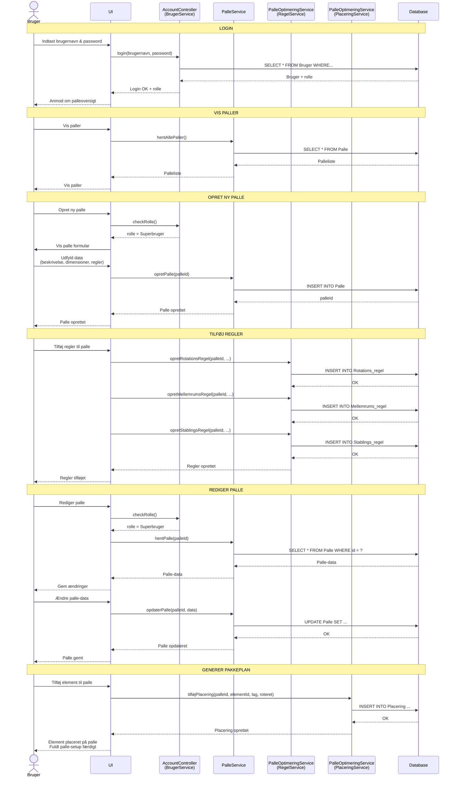

# Sekvensdiagram - PalleOptimering System

Dette diagram viser de vigtigste brugerflows gennem systemet, baseret på det oprindelige design.

## Flow Beskrivelser

### 1. Login Flow
- Bruger indtaster brugernavn og password
- `AccountController` (BrugerService) validerer mod database
- Returnerer bruger med rolle (NormalBruger eller SuperBruger)
- UI viser palleoversigt baseret på rolle

### 2. Vis Paller
- Både NormalBruger og SuperBruger kan se paller
- `PalleService` henter alle paller fra database
- UI viser palleliste

### 3. Opret Ny Palle (kun SuperBruger)
- Systemet checker om brugeren er SuperBruger
- Viser formular til at indtaste palle data
- `PalleService` opretter palle i database
- Returnerer palle ID

### 4. Tilføj Regler til Palle
- SuperBruger kan tilføje regler til en palle
- `PalleOptimeringService` (RegelService) håndterer:
  - Rotationsregler (må element roteres?)
  - Mellemrumsregler (afstand mellem elementer)
  - Stablingsregler (må der stables ovenpå?)
- Gemmes i database

**Note**: I den faktiske implementation er regler integreret i Palle og Element modellerne

### 5. Rediger Palle (kun SuperBruger)
- Systemet checker om brugeren er SuperBruger
- `PalleService` henter eksisterende palle data
- Bruger ændrer data
- `PalleService` opdaterer palle i database

### 6. Generer Pakkeplan (Tilføj Element til Palle)
- Bruger vælger elementer og palle
- `PalleOptimeringService` (PlaceringService) opretter placering
- Beregner lag, position og rotation
- Gemmer i database (Pakkeplan → PakkeplanPalle → PakkeplanElement)

## Service Mapping

| Oprindeligt Diagram | Faktisk Implementation |
|---------------------|------------------------|
| BrugerService | `AccountController` + `SignInManager` |
| PalleService | `PalleService` ✅ (match!) |
| RegelService | `PalleOptimeringService` |
| PlaceringService | `PalleOptimeringService` |

## Nøglepunkter

### Autorisation
- **NormalBruger**: Read-only adgang (kan kun se paller og elementer)
- **SuperBruger**: Fuld adgang (kan oprette, redigere, slette)
- Tjekkes via `[Authorize(Roles = "...")]` attributes

### Database Operationer
- Alle services kommunikerer med database via Entity Framework Core
- `PalleOptimeringContext` håndterer alle database operationer
- Transactions håndteres automatisk af DbContext

### Regler i Praksis
I den faktiske kode er reglerne integreret:
- **Rotationsregel**: `Element.RotationsRegel` (Nej, Ja, Skal)
- **Mellemrumsregel**: `Palle.LuftMellemElementer` (int i mm)
- **Stablingsregel**: `Element.ErGeometrielement` (bool)

Men flowet i sekvensdiagrammet viser konceptuelt hvordan regler håndteres.

### Placering/Pakkeplan
"Tilføj element til palle" svarer til at generere en pakkeplan:
1. Vælg elementer
2. Kør optimeringsalgoritme
3. Placer elementer på paller (lag, position, rotation)
4. Gem i `Pakkeplan` → `PakkeplanPalle` → `PakkeplanElement`
