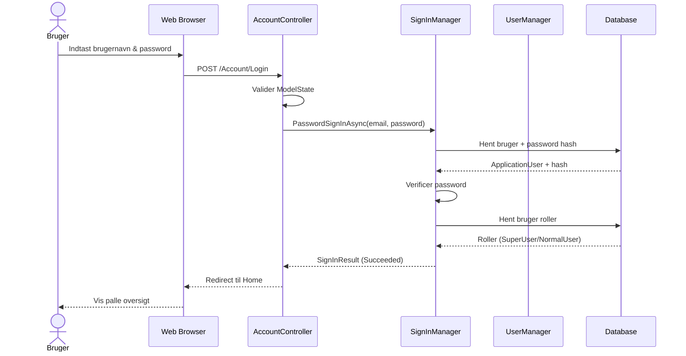
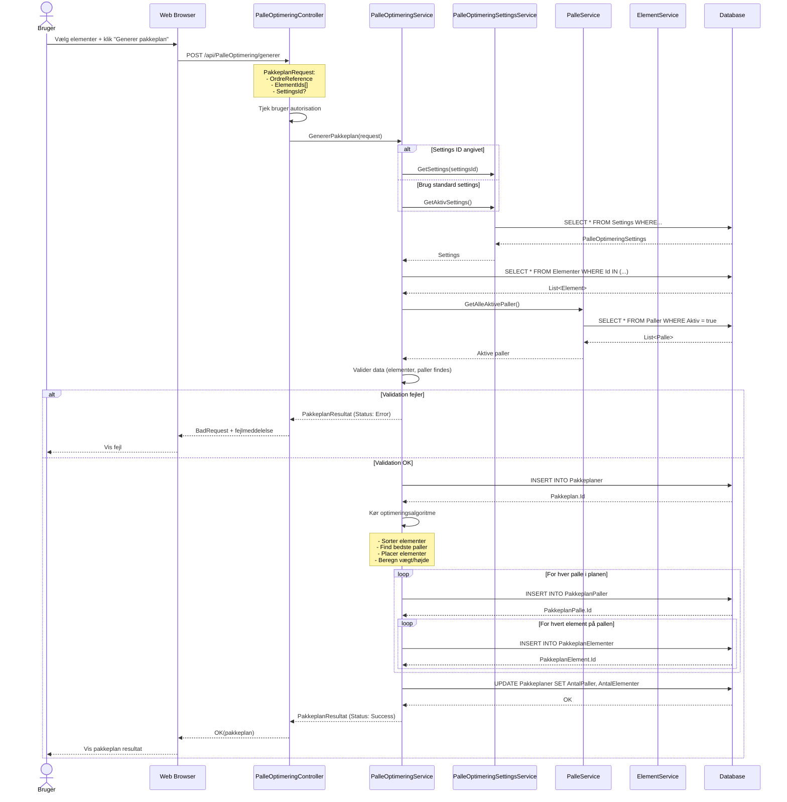
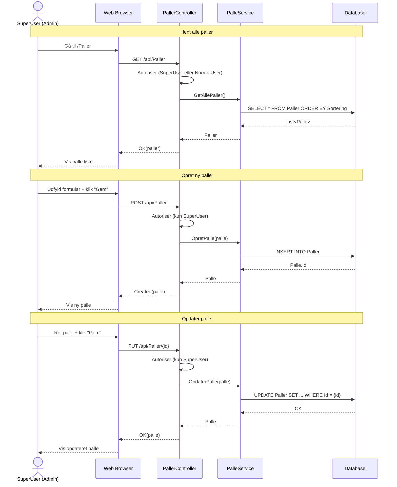
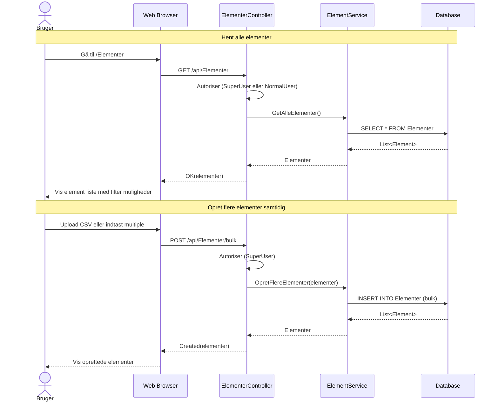
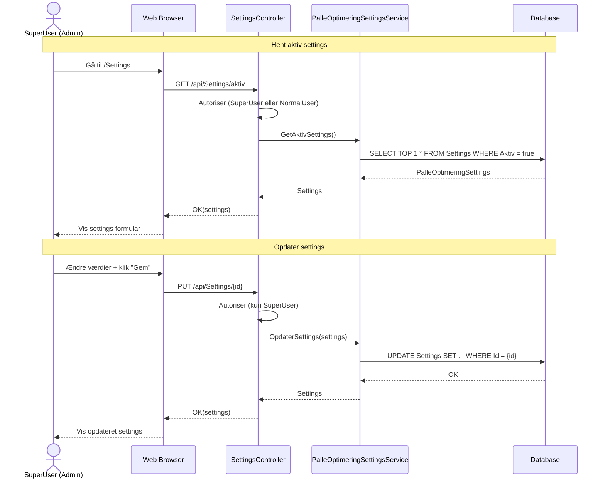

# Sekvensdiagrammer - PalleOptimering System

Dette dokument viser de vigtigste brugerflows i palleoptimering systemet.

## 1. Login Flow

## 2. Opret Pakkeplan Flow

## 3. Administrer Paller Flow

## 4. Administrer Elementer Flow

## 5. Administrer Settings Flow

## Nøglepunkter

### Autorisation
- Login flow: SignInManager håndterer authentication
- Alle endpoints kræver `[Authorize]` attribute
- SuperUser har fuld adgang
- NormalUser har read-only adgang til de fleste endpoints

### Service Layer Pattern
- Controllers afhænger af service interfaces (ikke konkrete implementationer)
- Services tilgår DbContext direkte (ingen repository lag)
- Dependency injection bruges til at injicere services

### Optimeringsalgoritme
`PalleOptimeringService.GenererPakkeplan()` indeholder kompleks logik:
1. Hent og valider input data
2. Sorter elementer efter prioritet (settings)
3. Find bedste palle for hvert element
4. Placer elementer med rotation/lag logik
5. Beregn vægt og højde
6. Gem resultat i database

### Fejlhåndtering
- Services returnerer `null` ved "ikke fundet"
- PakkeplanResultat indeholder `Status` og `Meddelelser[]`
- Controllers returnerer korrekte HTTP status codes

## Forskelle fra oprindeligt diagram

1. **ASP.NET Core Controllers**: I stedet for metoder på Bruger-klassen
2. **Service interfaces**: Dependency injection pattern
3. **DTOs**: PakkeplanRequest/PakkeplanResultat for API kommunikation
4. **Ingen RegelService**: Regler håndteres direkte i PalleOptimeringService
5. **Bulk operationer**: OpretFlereElementer() for efficiency
