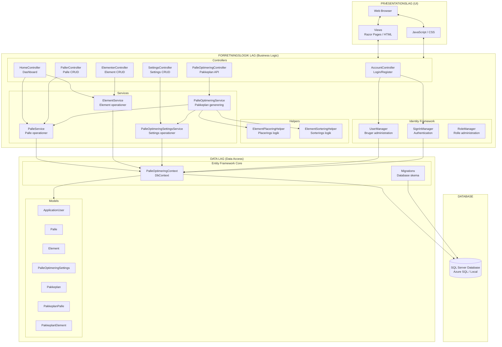
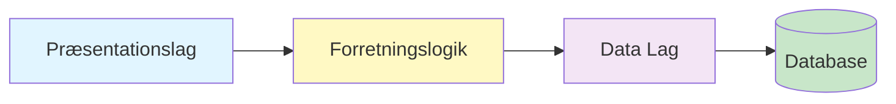
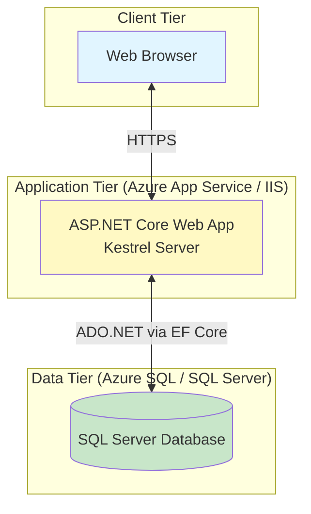
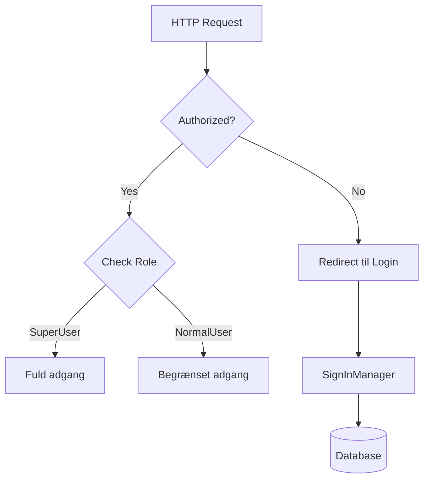

# Arkitekturdiagram - PalleOptimering System

Dette diagram viser systemets overordnede arkitektur og komponentopdeling.

## Overordnet Arkitektur

## 3-Lags Arkitektur

### 1. Præsentationslag
**Ansvar**: Brugerinteraktion og visning af data

Komponenter:
- **Web Browser**: Klient-side (HTML/CSS/JavaScript)
- **Views**: Razor views eller statiske HTML filer
- **JavaScript**: Frontend logik for interaktiv UI

Teknologier:
- ASP.NET Core MVC / Razor Pages
- HTML5, CSS3
- JavaScript (eventuelt med framework som React/Vue)

### 2. Forretningslogik Lag
**Ansvar**: Business logik, validering, autorisation

#### Controllers
MVC/API controllers der håndterer HTTP requests:

| Controller | Ansvar |
|------------|--------|
| `AccountController` | Brugerstyring (login, register, logout) |
| `HomeController` | Dashboard og hovedside |
| `PalleOptimeringController` | API til pakkeplan generering |
| `PallerController` | CRUD API for paller |
| `ElementerController` | CRUD API for elementer |
| `SettingsController` | CRUD API for optimerings-settings |

#### Services
Business logik og data operationer:

| Service | Ansvar |
|---------|--------|
| `PalleOptimeringService` | Hovedalgoritme for pakkeplan generering |
| `PalleService` | Palle CRUD operationer |
| `ElementService` | Element CRUD operationer |
| `PalleOptimeringSettingsService` | Settings CRUD operationer |

#### Helpers
Genbrugelig utility-logik:

| Helper | Ansvar |
|--------|--------|
| `ElementPlaceringHelper` | Logik for placering af elementer på paller |
| `ElementSorteringHelper` | Logik for sortering/prioritering af elementer |

#### Identity Framework
ASP.NET Core Identity til brugerstyring:
- `UserManager`: Bruger CRUD
- `SignInManager`: Login/logout
- `RoleManager`: Rolle administration (SuperUser, NormalUser)

### 3. Data Lag
**Ansvar**: Database adgang og data persistering

#### Entity Framework Core
- **PalleOptimeringContext**: DbContext med alle DbSets
- **Migrations**: Database schema versionsstyring

#### Models
Domain models der mapper til database tabeller:
- `ApplicationUser`: Brugere
- `Palle`: Palle typer
- `Element`: Elementer (døre/vinduer)
- `PalleOptimeringSettings`: Algoritme indstillinger
- `Pakkeplan` / `PakkeplanPalle` / `PakkeplanElement`: Pakkeplan struktur

### 4. Database
- **SQL Server**: Lokal eller Azure SQL Database
- **Tables**: Tabeller for alle entiteter + Identity tables

## Dependency Flow

**Vigtige principper:**
- ✅ Dependency injection for loose coupling
- ✅ Interface-baseret design (IPalleService, IElementService, etc.)
- ✅ Separation of concerns
- ✅ Services tilgår DbContext direkte (ikke Repository Pattern)

## Deployment Arkitektur

### Hosting Muligheder
1. **Azure**:
   - App Service for web app
   - Azure SQL Database
   - Application Insights for monitoring

2. **On-Premise**:
   - IIS / Windows Server
   - SQL Server lokalt
   - HTTPS med SSL certifikat

## Sikkerhed

### Sikkerhedsfeatures
- ✅ ASP.NET Core Identity authentication
- ✅ Role-based authorization (SuperUser, NormalUser)
- ✅ `[Authorize]` attributes på controllers
- ✅ Password hashing (Identity default)
- ✅ HTTPS (production)
- ✅ CSRF protection (built-in)
- ✅ SQL injection protection (EF Core parametrized queries)

## Teknologi Stack

| Lag | Teknologi |
|-----|-----------|
| **Frontend** | HTML5, CSS3, JavaScript, Razor Views |
| **Backend** | ASP.NET Core 6.0, C# |
| **API** | ASP.NET Core Web API |
| **Authentication** | ASP.NET Core Identity |
| **ORM** | Entity Framework Core 6 |
| **Database** | SQL Server / Azure SQL |
| **Hosting** | Azure App Service / IIS |

## Design Patterns

| Pattern | Anvendelse |
|---------|------------|
| **MVC** | Model-View-Controller arkitektur |
| **Dependency Injection** | Service registration og injection |
| **Interface Segregation** | IPalleService, IElementService, etc. |
| **Service Layer** | Forretningslogik adskilt fra controllers |
| **Data Transfer Object (DTO)** | PakkeplanRequest, PakkeplanResultat |
| **Unit of Work** | DbContext håndterer transactions |

## Forskelle fra Oprindeligt Diagram

1. **Ingen Repository Pattern**: Services tilgår DbContext direkte
2. **ASP.NET Core Identity**: Integreret authentication framework
3. **API Controllers**: RESTful API endpoints i stedet for traditional MVC
4. **Helper klasser**: ElementPlaceringHelper og ElementSorteringHelper for modulær logik
5. **DTOs**: Request/Response objekter for API kommunikation
6. **Cloud-ready**: Designet til Azure deployment

## Skalerbarhed

Systemet kan skaleres ved:
- ✅ Database indexering (optimering)
- ✅ Caching (Redis for session/data)
- ✅ Load balancing (Azure App Service scale-out)
- ✅ Async/await pattern (alle service metoder)
- ✅ Bulk operations (OpretFlereElementer)
