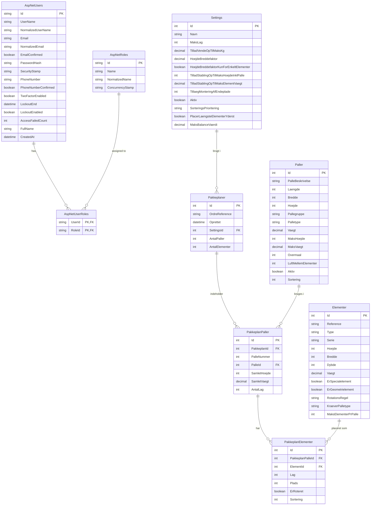

# ER-Diagram - Palleoptimering Database

Dette diagram viser database strukturen og relationerne mellem entiteter.

## Database Schema

## Forklaring af Tabeller

### Identity Tabeller (ASP.NET Core Identity)

#### AspNetUsers
Brugerkonti i systemet. Udvidet med:
- **FullName**: Brugerens fulde navn
- **CreatedAt**: Hvornår brugeren blev oprettet

#### AspNetRoles
Roller i systemet:
- **SuperUser**: Fuld adgang til alle funktioner
- **NormalUser**: Kan se data men ikke oprette/redigere

#### AspNetUserRoles
Kobling mellem brugere og roller (many-to-many)

### Applikations Tabeller

#### Paller
Master data for tilgængelige palle typer.
- Definerer fysiske dimensioner (længde, bredde, højde)
- Kapacitetsbegrænsninger (maks højde, maks vægt)
- Regler (overmål, luft mellem elementer)

**Primær nøgle**: Id
**Seed data**: 3 standard træpaller (75'er, 80'er, 100'er)

#### Elementer
Katalog over elementer (døre/vinduer) der skal pakkes.
- Fysiske dimensioner og vægt
- Type klassifikation (Dør, Vindue, Special)
- Serie gruppering for sortering
- Specielle markeringer (specialelement, geometrielement)
- Rotationsregler (Nej, Ja, Skal)

**Primær nøgle**: Id
**Seed data**: 8 test elementer (døre, vinduer, special)

#### Settings
Konfigurerbare regler for optimeringsalgoritmen.
- Maks antal lag på palle
- Vægt- og højdebegrænsninger
- Rotations- og stablings-regler
- Sorteringskriterier
- Balance-regler

**Primær nøgle**: Id
**Seed data**: 1 standard settings profil

#### Pakkeplaner
Genererede pakkeplaner - resultat af optimering.
- Reference til ordre
- Tidsstempel for hvornår den blev genereret
- Statistik (antal paller, antal elementer)
- Reference til hvilke settings der blev brugt

**Primær nøgle**: Id
**Fremmednøgle**: SettingsId → Settings

#### PakkeplanPaller
Individuelle paller i en pakkeplan.
- Palle nummer i rækkefølge (1, 2, 3...)
- Reference til palle type fra Paller tabel
- Statistik for denne palle (samlet højde, vægt, antal lag)

**Primær nøgle**: Id
**Fremmednøgler**:
- PakkeplanId → Pakkeplaner
- PalleId → Paller

#### PakkeplanElementer
Placering af specifikke elementer på paller.
- Hvilket lag elementet er i (1 = nederst)
- Plads nummer på pallen (1-5)
- Om elementet blev roteret
- Sorteringsorden

**Primær nøgle**: Id
**Fremmednøgler**:
- PakkeplanPalleId → PakkeplanPaller
- ElementId → Elementer

## Kardinalitet

### One-to-Many Relationer
- **Settings → Pakkeplaner**: Én settings profil kan bruges i mange pakkeplaner
- **Pakkeplaner → PakkeplanPaller**: Én pakkeplan indeholder mange paller
- **Paller → PakkeplanPaller**: Én palle type bruges i mange pakkeplan-paller
- **PakkeplanPaller → PakkeplanElementer**: Én palle har mange elementer
- **Elementer → PakkeplanElementer**: Ét element kan placeres på mange paller (i forskellige planer)

### Many-to-Many Relationer
- **AspNetUsers ↔ AspNetRoles**: Via AspNetUserRoles junction tabel

## Database Indekser

Følgende indekser oprettes automatisk af Entity Framework:
- Primary Keys på alle Id kolonner
- Foreign Key indekser på alle FK kolonner
- Unique indeks på AspNetUsers.NormalizedUserName
- Unique indeks på AspNetUsers.NormalizedEmail
- Unique indeks på AspNetRoles.NormalizedName

## Constraints

### NOT NULL Constraints
- Alle Id kolonner
- Required felter markeret med `[Required]` attribut i models

### Decimal Precision
- Vægt felter: DECIMAL(18,2)
- Settings faktorer: DECIMAL(18,2) eller DECIMAL(5,2)

### String Lengths
- PalleBeskrivelse: max 100 tegn
- Element.Reference: max 100 tegn
- Element.Type/Serie: max 50-100 tegn
- Settings.Navn: max 100 tegn
- Settings.SorteringsPrioritering: max 500 tegn

## Cascade Delete

- **Pakkeplaner → PakkeplanPaller**: CASCADE
  - Når en pakkeplan slettes, slettes alle dens paller
- **PakkeplanPaller → PakkeplanElementer**: CASCADE
  - Når en pakkeplan-palle slettes, slettes alle dens elementer

**OBS**: Master data (Paller, Elementer, Settings) har RESTRICT for at forhindre utilsigtet sletning af data der bruges i eksisterende pakkeplaner.
