# Klassediagram - Palleoptimering System

Dette diagram viser systemets arkitektur med Models, Controllers, Services og deres relationer.

## MVC Arkitektur Overview

```mermaid
classDiagram
    %% Controllers
    class HomeController {
        +Index() IActionResult
        +Paller() IActionResult
        +Elementer() IActionResult
        +Optimering() IActionResult
        +Settings() IActionResult
    }

    class AccountController {
        -SignInManager signInManager
        -UserManager userManager
        +Login() IActionResult
        +Register() IActionResult
        +Logout() Task~IActionResult~
    }

    class PallerController {
        -IPalleService palleService
        +GetAllePaller() Task~ActionResult~
        +GetPalle(id) Task~ActionResult~
        +OpretPalle(palle) Task~ActionResult~
        +OpdaterPalle(id, palle) Task~ActionResult~
        +SletPalle(id) Task~ActionResult~
    }

    class ElementerController {
        -IElementService elementService
        -ILogger logger
        +GetAlleElementer() Task~ActionResult~
        +GetElement(id) Task~ActionResult~
        +OpretElement(element) Task~ActionResult~
        +OpretFlereElementer(elementer) Task~ActionResult~
        +OpdaterElement(id, element) Task~ActionResult~
        +SletElement(id) Task~ActionResult~
        +ForceSeedElementer() Task~ActionResult~
    }

    class PalleOptimeringController {
        -IPalleOptimeringService optimeringService
        +GenererPakkeplan(request) Task~ActionResult~
        +GetAllePakkeplaner() Task~ActionResult~
        +GetPakkeplan(id) Task~ActionResult~
    }

    class SettingsController {
        -IPalleOptimeringSettingsService settingsService
        +GetSettings() Task~ActionResult~
        +OpdaterSettings(id, settings) Task~ActionResult~
    }

    %% Services (Interfaces)
    class IPalleService {
        <<interface>>
        +GetAllePaller() Task~IEnumerable~
        +GetAlleAktivePaller() Task~IEnumerable~
        +GetPalle(id) Task~Palle~
        +OpretPalle(palle) Task~Palle~
        +OpdaterPalle(palle) Task~Palle~
        +SletPalle(id) Task~bool~
    }

    class IElementService {
        <<interface>>
        +GetAlleElementer() Task~IEnumerable~
        +GetElement(id) Task~Element~
        +OpretElement(element) Task~Element~
        +OpretFlereElementer(elementer) Task~IEnumerable~
        +OpdaterElement(element) Task~Element~
        +SletElement(id) Task~bool~
    }

    class IPalleOptimeringService {
        <<interface>>
        +GenererPakkeplan(request) Task~PakkeplanResultat~
        +GetAllePakkeplaner() Task~IEnumerable~
        +GetPakkeplan(id) Task~Pakkeplan~
    }

    class IPalleOptimeringSettingsService {
        <<interface>>
        +GetSettings() Task~IEnumerable~
        +GetAktivSettings() Task~PalleOptimeringSettings~
        +OpdaterSettings(settings) Task~PalleOptimeringSettings~
    }

    %% Services (Implementation)
    class PalleService {
        -PalleOptimeringContext context
        +GetAllePaller() Task~IEnumerable~
        +GetAlleAktivePaller() Task~IEnumerable~
        +GetPalle(id) Task~Palle~
        +OpretPalle(palle) Task~Palle~
        +OpdaterPalle(palle) Task~Palle~
        +SletPalle(id) Task~bool~
    }

    class ElementService {
        -PalleOptimeringContext context
        +GetAlleElementer() Task~IEnumerable~
        +GetElement(id) Task~Element~
        +OpretElement(element) Task~Element~
        +OpretFlereElementer(elementer) Task~IEnumerable~
        +OpdaterElement(element) Task~Element~
        +SletElement(id) Task~bool~
    }

    class PalleOptimeringService {
        -PalleOptimeringContext context
        -IPalleOptimeringSettingsService settingsService
        -IElementService elementService
        -IPalleService palleService
        +GenererPakkeplan(request) Task~PakkeplanResultat~
        +GetAllePakkeplaner() Task~IEnumerable~
        +GetPakkeplan(id) Task~Pakkeplan~
    }

    class PalleOptimeringSettingsService {
        -PalleOptimeringContext context
        +GetSettings() Task~IEnumerable~
        +GetAktivSettings() Task~PalleOptimeringSettings~
        +OpdaterSettings(settings) Task~PalleOptimeringSettings~
    }

    %% Models
    class ApplicationUser {
        +string Id
        +string UserName
        +string Email
        +string FullName
        +DateTime CreatedAt
    }

    class Palle {
        +int Id
        +string PalleBeskrivelse
        +int Laengde
        +int Bredde
        +int Hoejde
        +string Pallegruppe
        +string Palletype
        +decimal Vaegt
        +int MaksHoejde
        +decimal MaksVaegt
        +int Overmaal
        +int LuftMellemElementer
        +bool Aktiv
        +int Sortering
    }

    class Element {
        +int Id
        +string Reference
        +string Type
        +string Serie
        +int Hoejde
        +int Bredde
        +int Dybde
        +decimal Vaegt
        +bool ErSpecialelement
        +bool ErGeometrielement
        +string RotationsRegel
        +string KraeverPalletype
        +int? MaksElementerPrPalle
    }

    class PalleOptimeringSettings {
        +int Id
        +string Navn
        +int MaksLag
        +decimal TilladVendeOpTilMaksKg
        +decimal HoejdeBreddefaktor
        +bool HoejdeBreddefaktorKunForEnkeltElementer
        +int? TilladStablingOpTilMaksHoejdeInklPalle
        +decimal? TilladStablingOpTilMaksElementVaegt
        +int TillaegMonteringAfEndeplade
        +bool Aktiv
        +string SorteringsPrioritering
        +bool PlacerLaengsteElementerYderst
        +decimal? MaksBalanceVaerdi
    }

    class Pakkeplan {
        +int Id
        +string OrdreReference
        +DateTime Oprettet
        +int? SettingsId
        +int AntalPaller
        +int AntalElementer
        +ICollection~PakkeplanPalle~ Paller
    }

    class PakkeplanPalle {
        +int Id
        +int PakkeplanId
        +int PalleNummer
        +int PalleId
        +int SamletHoejde
        +decimal SamletVaegt
        +int AntalLag
        +ICollection~PakkeplanElement~ Elementer
    }

    class PakkeplanElement {
        +int Id
        +int PakkeplanPalleId
        +int ElementId
        +int Lag
        +int Plads
        +bool ErRoteret
        +int Sortering
    }

    class PalleOptimeringContext {
        +DbSet~Palle~ Paller
        +DbSet~Element~ Elementer
        +DbSet~PalleOptimeringSettings~ Settings
        +DbSet~Pakkeplan~ Pakkeplaner
        +DbSet~PakkeplanPalle~ PakkeplanPaller
        +DbSet~PakkeplanElement~ PakkeplanElementer
        +DbSet~ApplicationUser~ Users
    }

    %% DTOs
    class PakkeplanRequest {
        +List~int~ ElementIds
        +int? SettingsId
        +string OrdreReference
    }

    class PakkeplanResultat {
        +string Status
        +string Message
        +Pakkeplan Pakkeplan
        +List~PalleInfo~ Paller
    }

    %% Relationships - Controllers to Services
    PallerController --> IPalleService : uses
    ElementerController --> IElementService : uses
    PalleOptimeringController --> IPalleOptimeringService : uses
    SettingsController --> IPalleOptimeringSettingsService : uses

    %% Relationships - Services Implementation
    PalleService ..|> IPalleService : implements
    ElementService ..|> IElementService : implements
    PalleOptimeringService ..|> IPalleOptimeringService : implements
    PalleOptimeringSettingsService ..|> IPalleOptimeringSettingsService : implements

    %% Relationships - Services to Context
    PalleService --> PalleOptimeringContext : uses
    ElementService --> PalleOptimeringContext : uses
    PalleOptimeringService --> PalleOptimeringContext : uses
    PalleOptimeringSettingsService --> PalleOptimeringContext : uses

    %% Relationships - Service Dependencies
    PalleOptimeringService --> IPalleOptimeringSettingsService : depends on
    PalleOptimeringService --> IElementService : depends on
    PalleOptimeringService --> IPalleService : depends on

    %% Relationships - Model Associations
    Pakkeplan --> PalleOptimeringSettings : uses
    Pakkeplan "1" --> "*" PakkeplanPalle : contains
    PakkeplanPalle --> Palle : references
    PakkeplanPalle "1" --> "*" PakkeplanElement : contains
    PakkeplanElement --> Element : references

    %% DTOs
    PalleOptimeringController --> PakkeplanRequest : receives
    PalleOptimeringController --> PakkeplanResultat : returns
```

## Forklaring af Arkitekturen

### Controllers (API Layer)
- **HomeController**: Håndterer navigation til forskellige sider
- **AccountController**: Håndterer login, registrering og logout
- **PallerController**: REST API for palle CRUD operationer
- **ElementerController**: REST API for element CRUD operationer
- **PalleOptimeringController**: Genererer pakkeplaner
- **SettingsController**: Administrerer optimeringsindstillinger

### Services (Business Logic Layer)
- **PalleService**: Forretningslogik for paller
- **ElementService**: Forretningslogik for elementer
- **PalleOptimeringService**: Hovedalgoritme for palleoptimering
- **PalleOptimeringSettingsService**: Håndterer indstillinger

### Models (Data Layer)
- **Palle**: Definition af palle typer
- **Element**: Døre/vinduer der skal pakkes
- **PalleOptimeringSettings**: Konfigurerbare regler
- **Pakkeplan**: Genereret pakkeplan
- **PakkeplanPalle**: Paller i en plan
- **PakkeplanElement**: Elementer placeret på paller

### Data Access
- **PalleOptimeringContext**: Entity Framework DbContext der håndterer database adgang
