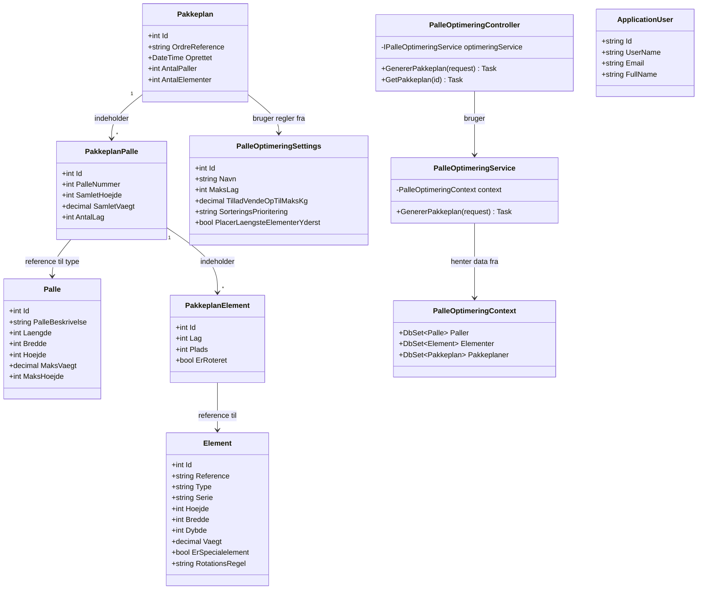

# Klassediagram - Palleoptimering System

Dette diagram viser de vigtigste dele af systemets arkitektur.

## Forenklet Klassediagram



## Forklaring af Diagrammet

### Hovedkomponenter

#### Controller Layer
- **PalleOptimeringController**: Modtager HTTP requests og kalder service layer

#### Service Layer
- **PalleOptimeringService**: Indeholder kernelogikken for palleoptimering

#### Data Layer
- **PalleOptimeringContext**: Entity Framework DbContext for database adgang

### Domæne Modeller

#### Master Data (Input)
- **Palle**: Definition af tilgængelige palle typer med dimensioner og kapacitet
- **Element**: Døre/vinduer der skal pakkes med dimensioner og vægt
- **PalleOptimeringSettings**: Konfigurerbare regler for optimeringsalgoritmen
- **ApplicationUser**: Brugere med roller (SuperUser/NormalUser)

#### Genereret Data (Output)
- **Pakkeplan**: Resultat af optimering med antal paller og elementer
- **PakkeplanPalle**: Individuelle paller i planen med statistik
- **PakkeplanElement**: Præcis placering af hvert element på pallen

### Data Flow

```
1. Input elementer → PalleOptimeringController
2. Controller → PalleOptimeringService (med settings)
3. Service henter data fra PalleOptimeringContext
4. Service kører optimeringsalgoritme
5. Service opretter Pakkeplan med PakkeplanPaller og PakkeplanElementer
6. Resultat returneres til controller → client
```

### Vigtigste Relationer

- **Pakkeplan (1) → (*) PakkeplanPalle**: Én pakkeplan består af flere paller
- **PakkeplanPalle (1) → (*) PakkeplanElement**: Hver palle har flere elementer
- **PakkeplanPalle → Palle**: Reference til palle type fra master data
- **PakkeplanElement → Element**: Reference til element fra master data
- **Pakkeplan → PalleOptimeringSettings**: Hvilke regler der blev brugt

## Yderligere Komponenter

Systemet har også (ikke vist i diagrammet for overskuelighedens skyld):
- **HomeController, AccountController**: Navigation og authentication
- **PallerController, ElementerController, SettingsController**: CRUD API endpoints
- **Services**: PalleService, ElementService, PalleOptimeringSettingsService for CRUD operationer
